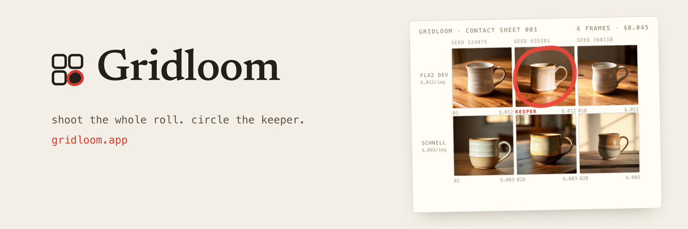
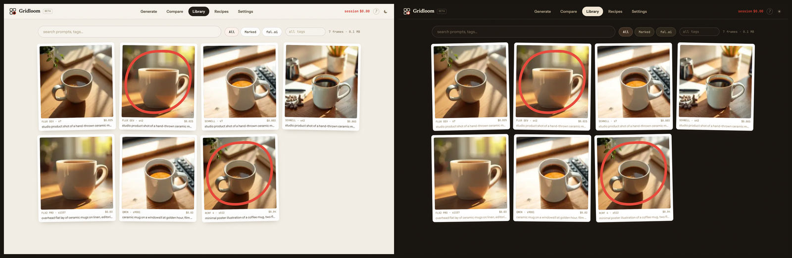

<p align="center">
  
</p>

# Gridloom

An AI image studio that runs one prompt across many models at once, so you can see the difference instead of guessing at it.

You bring your own API keys. They live in your browser and go straight to the provider. There is no backend, no account, and no server of mine that ever sees a key or an image.

**[gridloom.app](https://gridloom.app)**

<p align="center">
  
</p>

<p align="center"><em>The same library in both modes. Light is a positive print, dark is its negative.</em></p>

## What it does

Most image tools give you one model and one frame at a time. Gridloom is built around comparison: pick several models, pick several seeds, run the same prompt across all of them, and get back a contact sheet you can actually judge.

- **Comparison grid.** N models by M seeds in one run, laid out as a contact sheet.
- **13 models, 3 providers.** fal.ai (9), Google Gemini (2), OpenAI (2). Every model's parameter schema was verified by hand against the live provider API.
- **Cost meter.** A per-run estimate before you spend anything, from a static price table. Always labeled an estimate, because only the provider knows the real number.
- **Local library.** Every generation, prompt, seed, and parameter is kept in IndexedDB and searchable. Exports to a plain zip whenever you want.
- **Recipes.** Save a setup that worked and re-run it later.
- **Light table.** Mark up a sheet with a grease pencil and pick the keeper.

## The privacy design

This is the part I would look at first if I were reading someone else's repo.

Gridloom is a static single-page app. There is no backend at all, which means the usual "we never look at your data" promise is replaced by there being nowhere for the data to go.

- Keys are stored in `localStorage` and attached only to requests aimed at that provider's own domain.
- Images and metadata live in IndexedDB on your machine.
- A strict Content-Security-Policy pins `connect-src` to the three provider origins, so even a successful XSS has nowhere to exfiltrate a key to. See [`public/_headers`](public/_headers).

Open the network tab while you use it. There are no requests to any origin I control.

## Stack

React · Vite · TypeScript (strict) · Tailwind v4 · Zustand · Dexie (IndexedDB) · Base UI · deployed as static files to Cloudflare Pages.

## Architecture

```
src/lib/models.ts       model registry: params, prices, capabilities, per provider
src/lib/providers/      one normalized adapter per provider behind a single interface
src/lib/errors.ts       provider errors mapped to a small typed taxonomy
src/lib/db.ts           Dexie schema for generations, image blobs, recipes, tags
src/stores/             Zustand stores (settings, draft, theme, pen, cost)
src/pages/GridPage.tsx  the comparison grid
```

Adding a model is usually a registry entry. Adding a provider is one adapter that implements `generate` and `testKey`.

The error taxonomy is worth a look if you have ever integrated three image APIs: they fail in genuinely different ways, and `errors.ts` normalizes billing-required, rate-limited, quota-exceeded, content-blocked and model-unavailable into something the UI can act on.

## Design

The visual system is a photo studio. Light mode is a positive print on warm paper; dark mode is the film negative of it. One accent red, three weights of ink, and a rule that an arch-topped frame means "not yet developed" while revealed artwork is always a full rectangle.

Tokens live in `src/index.css`. The design source files are in `design/` as `.dc.html` canvases, with the reasoning in [`design/RATIONALE.md`](design/RATIONALE.md). Those canvases are an archive from the commercial build, so a few screens still show pricing UI the shipped app does not have.

## Running it

```sh
npm install
npm run dev
```

Then open Settings and paste a key from any one provider. fal.ai alone reaches 9 of the 13 models and costs about $0.003 an image on the cheap end.

```sh
npm run build      # static output to dist/
npm run typecheck
```

## A caveat about the model registry

Model prices and parameter schemas change often. The registry was verified against the live provider APIs as of **August 2026** and it will drift. If a price looks wrong it probably is, and a PR is welcome.

## Status

I built this as a commercial product and did not launch it. The code is here because the engineering and the design are worth more in public than they are sitting in a private repo. It works, it is genuinely useful, and it is no longer trying to be a business.

Fork it, take the adapters, take the design system, take whatever is useful.

## License

MIT. See [LICENSE](LICENSE).
